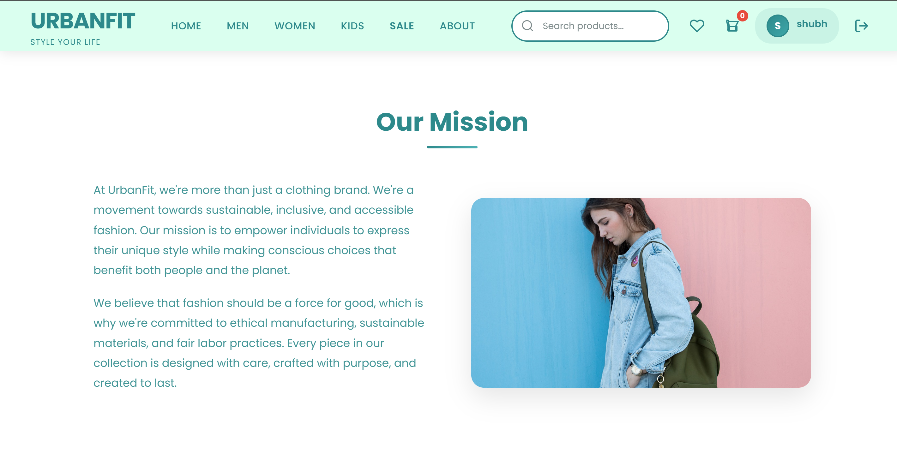
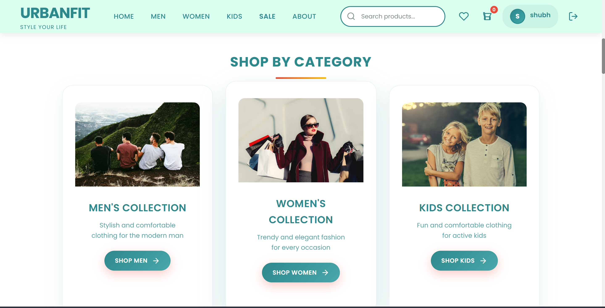
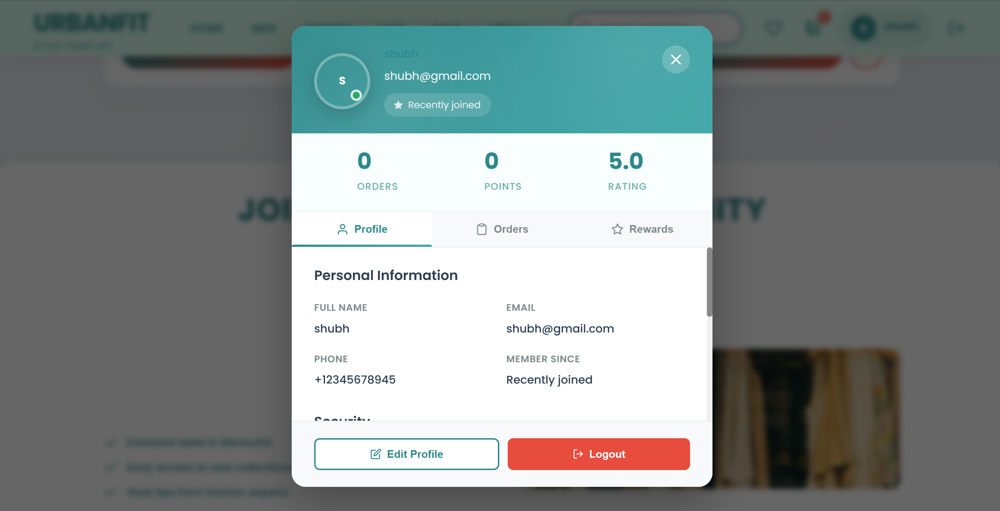
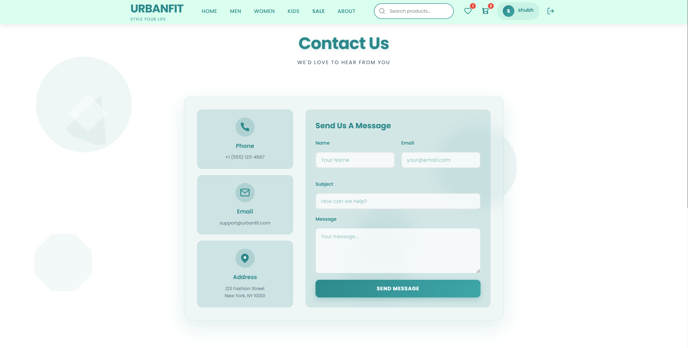

# 👟 **UrbanFit**
*Style That Moves With You*

Welcome to UrbanFit - your digital closet, your style scout, and your favorite fitting room, all in one place. We're not just selling clothes; we're curating looks, building confidence, and helping you step out in something that actually feels like *you*.

<div align="center">
  
  
</div>

---

## **Table of Contents**
* [About UrbanFit](#about-urbanfit)
* [What Makes Us Special](#what-makes-us-special)
* [Features](#features)
* [Getting Started](#getting-started)
* [Installation](#installation)
* [Usage](#usage)
* [Contributing](#contributing)
* [Terms & Love](#terms--love)

---

## **About UrbanFit**
UrbanFit isn't just another shopping app - it's your personal stylist, wardrobe curator, and outfit companion all rolled into one delightful experience. Whether you're chasing the latest streetwear drop or building a timeless everyday wardrobe, we've crafted something special just for you.

**Our Mission:** To turn everyday dressing into a moment of self-expression through technology, community, and effortless style.

<div align="center">
  
</div>

---

## **What Makes Us Special**

### 🌟 **The UrbanFit Experience**
- **Curated Collections:** From everyday essentials to statement pieces, every drop is handpicked
- **Style for Everyone:** Looks for men, women, and kids — because the whole family deserves to look good
- **Smart Shopping:** Browse by category, discover featured picks, and find exactly what fits your vibe
- **Warm Community:** Join a growing crew of people who care about how they show up

---

## **Features**

### 👕 **Fashion, Found Fast**
- **Featured Picks:** Hand-selected pieces our team can't stop talking about
- **Shop by Category:** Men's, women's, and kids' fits — organized so you find your thing fast
- **Effortless Browsing:** A smooth, snappy interface that gets out of your way

<br>
<div align="center">
  
  
</div>
<br>

### 🔐 **Your Closet, Your Account**
- **Personal Profiles:** Save your details and make checkout a breeze
- **Order History:** Track every order from "just clicked buy" to "on your doorstep"
- **Secure Sign-In:** Your information, protected and respected

<br>
<div align="center">
  
</div>
<br>

### 🛒 **Seamless Shopping**
- **Easy Checkout:** From cart to confirmation in just a few taps
- **Order Tracking:** Know exactly where your fit is, every step of the way
- **Flexible Cancellations:** Changed your mind? We've got you covered

<br>
<div align="center">
  
</div>
<br>

### 🏠 **Lovely Environment**
- **Interactive UI:** Every tap, swipe, and scroll feels effortless
- **Responsive Design:** Looks just as good on your phone as it does on your laptop
- **Community Features:** A storefront that feels alive, not static

---

## **Getting Started**

### **Prerequisites**
Before stepping into the UrbanFit experience, ensure you have:
- Node.js (v18 or higher) installed on your local machine
- npm (comes bundled with Node.js)
- A love for good style ✨
- An appreciation for clean, functional design

### **What You'll Need**
- A local environment to run the frontend and backend together
- Nothing fancy — just your terminal and a sense of curiosity

---

## **Installation**

Ready to build your perfect wardrobe? Let's get started:

### 1. **Clone Your New Favorite Closet**
```bash
git clone https://github.com/yourusername/urbanfit.git
```

### 2. **Step Into the UrbanFit World**
```bash
cd urbanfit
```

### 3. **Install the Essentials**
```bash
npm install
```

---

## **Usage**

### **Start Your Style Journey**

Fire up the backend:
```bash
npm run start:server
```

Then bring the frontend to life:
```bash
npm run dev
```

Visit `http://localhost:5173` and watch your new favorite storefront come alive! ✨

---

## **Contributing**

We believe the best style comes from collaboration (much like the perfect outfit). Here's how you can be part of our story:

1. Fork the repo
2. Create a feature branch
3. Run and test locally
4. Open a pull request with a clear description

---

## **Terms & Love**

### **Our Promise**
UrbanFit is crafted with love for the style community. This project is currently for educational and demo purposes, but we're stitching together plans for something bigger. Stay tuned!

---

## **Contact Us**

Have questions or just want to say hi? We'd love to hear from you!

<div align="center">
  
</div>

---

## **A Final Thread of Gratitude**

Thank you for being part of the UrbanFit journey. Whether you're here to code, contribute, or just appreciate good style, you're exactly where you belong.

*"Life's too short for boring outfits and clunky apps. Let's make both extraordinary."*

---

**Made with 👟 and 💝 by style lovers, for style lovers**

*UrbanFit - Style That Moves With You*
